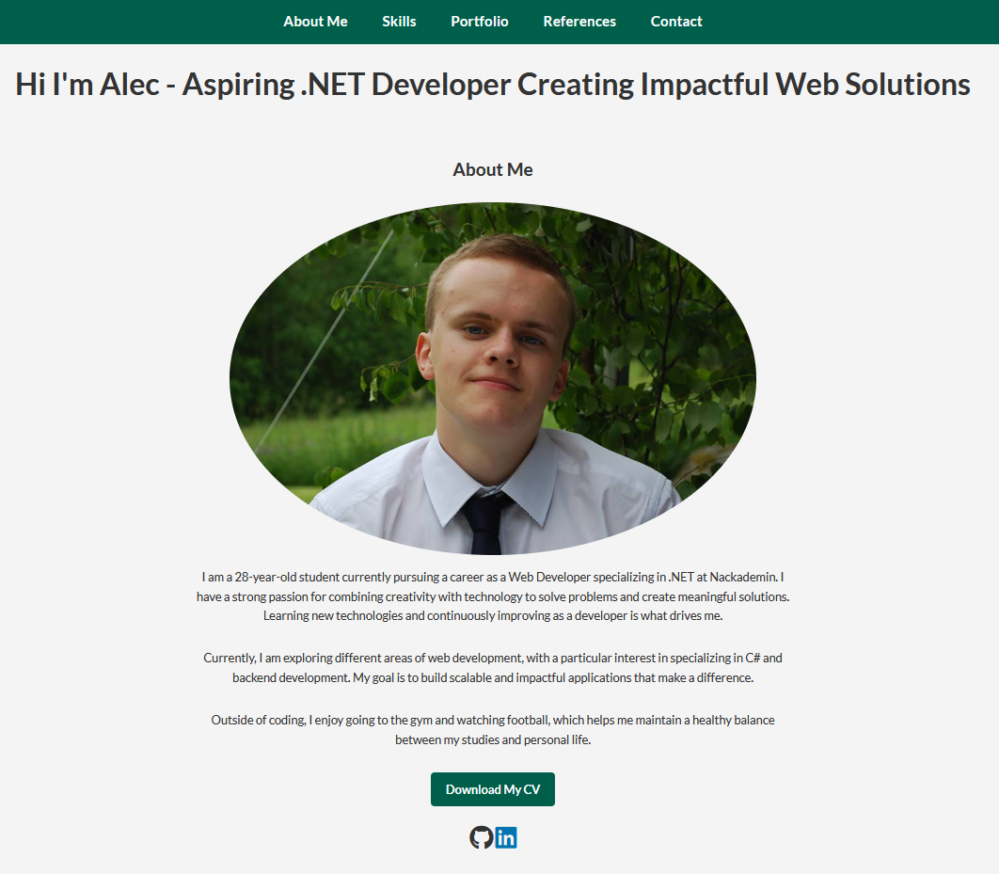

# Developer Portfolio

## Description
This is a developer portfolio built using HTML, CSS, and JavaScript. The portfolio showcases my skills, projects, and references, and includes a contact form for users to get in touch with me.

## Features
- Clean and professional design.
- Responsive layout for mobile, tablet, and desktop.
- Hamburger menu for mobile navigation.
- Smooth scrolling for navigation links.
- Dynamic year display in the footer.
- Functional contact form with validation using JavaScript.
- Downloadable CV and social media links.

## Technologies Used
- **HTML5**: Semantic structure for content.
- **CSS3**: Styling and responsive design.
- **JavaScript**: Dynamic interactions and validation.
- **FontAwesome**: Icons for a modern look.

## How To Run Locally
1. Clone the repository:
   ```bash
   git clone https://github.com/Alec-23/portfolio.git
2. Navigate to the project directory:
    ```bash
    cd PortFolio
3. Open the index.html file in your browser to view the portfolio.


## Screenshots
Here is a preview of the portfolio:

### Homepage Screenshot
*The homepage with a clean, professional design.*



### Skills, Portfolio, References Screenshot
*Skills, portfolio, and references sections showcasing abilities and projects.*


### Contact Me, Footer Screenshot
*Contact form and footer with dynamic year display.*


## Lessons Learned
- Improved understanding of HTML5 semantics.
- Learned to implement responsive design and styling using CSS3.
- Enhanced JavaScript skills by creating interactive elements such as form validation and hamburger menus.

## Author
**Alec Christensen**  
- [GitHub Profile](https://github.com/Alec-23)  
- [LinkedIn Profile](https://www.linkedin.com/in/alec-christensen-3a4a4a338/) 

## License
This project is licensed under the MIT License.
